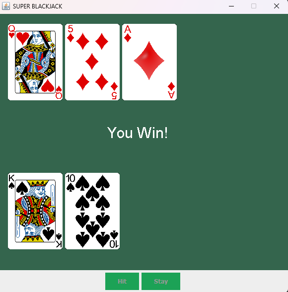

# Blackjack Game

This project is a graphical implementation of the popular card game **Blackjack** (also known as 21) using Java and Swing. It features a fully functional game with interactive buttons, card deck generation, and a user-friendly interface for an enjoyable gaming experience.

## Table of Contents
- [Features](#features)
- [Technologies Used](#technologies-used)
- [Installation](#installation)
- [Usage](#usage)
- [File Structure](#file-structure)
- [Game Rules](#game-rules)
- [Screenshots](#screenshots)
- [License](#license)

## Features
- A fully interactive GUI built with Swing.
- Dynamic deck creation and shuffling for every game.
- Dealer and player logic for card drawing and scoring.
- Visual representation of cards, including hidden dealer cards.
- Interactive buttons for "Hit" and "Stay" functionality.
- Automatically calculates scores and determines the game outcome.

## Technologies Used
- **Programming Language:** Java
- **GUI Framework:** Swing

## Installation

### Prerequisites
- Java Development Kit (JDK) 8 or higher
- IDE or text editor that supports Java (e.g., IntelliJ IDEA, Eclipse, VS Code)

### Steps
1. **Clone the repository:**
   ```bash
   git clone https://github.com/your-username/blackjack-game.git
   cd blackjack-game
   ```

2. **Set up the environment:**
   Ensure you have a Java compiler and runtime installed. You can verify this by running:
   ```bash
   java -version
   javac -version
   ```

3. **Compile the code:**
   Navigate to the `src` directory and compile the Java files:
   ```bash
   javac App.java
   ```

4. **Run the game:**
   Launch the game using:
   ```bash
   java App
   ```

## Usage
1. Launch the application.
2. The dealer and player are each dealt two cards to start.
3. Use the **Hit** button to draw another card or the **Stay** button to hold your current hand.
4. The game calculates the scores and determines the winner based on Blackjack rules.

## File Structure
```
Blackjack-Game/
├── .vscode/                  # IDE settings
├── lib/                      # Dependencies (if any)
├── src/                      # Source code
│   ├── cards/                # Directory for card images
│   ├── App.java              # Main entry point
│   └── BlackJack.java        # Game logic and GUI implementation
├── README.md                 # Project documentation
```

## Game Rules
1. **Objective:** Get a hand value closer to 21 than the dealer without exceeding 21.
2. **Card Values:**
   - Number cards are worth their face value.
   - Face cards (J, Q, K) are worth 10.
   - Aces are worth 11 or 1, depending on the hand value.
3. **Gameplay:**
   - Each player is dealt two cards. One of the dealer's cards is hidden.
   - The player can choose to "Hit" to draw a card or "Stay" to keep their current hand.
   - The dealer draws cards until their hand value is at least 17.
4. **Winning Conditions:**
   - The player wins if their hand value is closer to 21 than the dealer's or if the dealer's hand exceeds 21.
   - The game ends in a tie if both hands have the same value.
   - The player loses if their hand exceeds 21.

## Screenshots
### Game Interface


## License
This project is licensed under the MIT License. You are free to use, modify, and distribute this software as long as the original license is included.

---
Feel free to contribute to the project or report issues by opening a pull request or an issue on GitHub!

